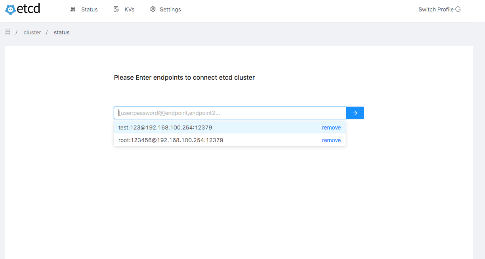
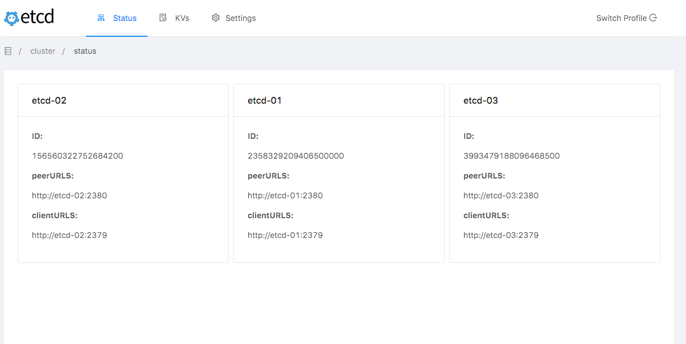
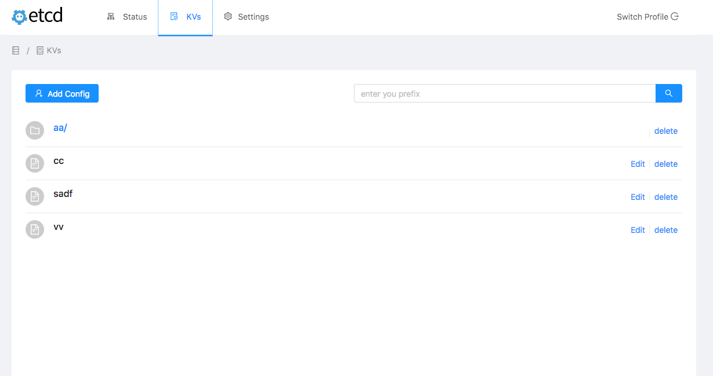
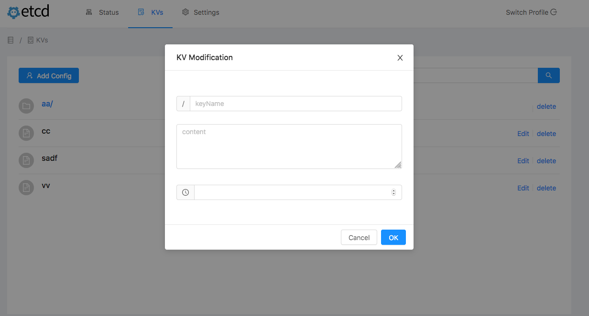
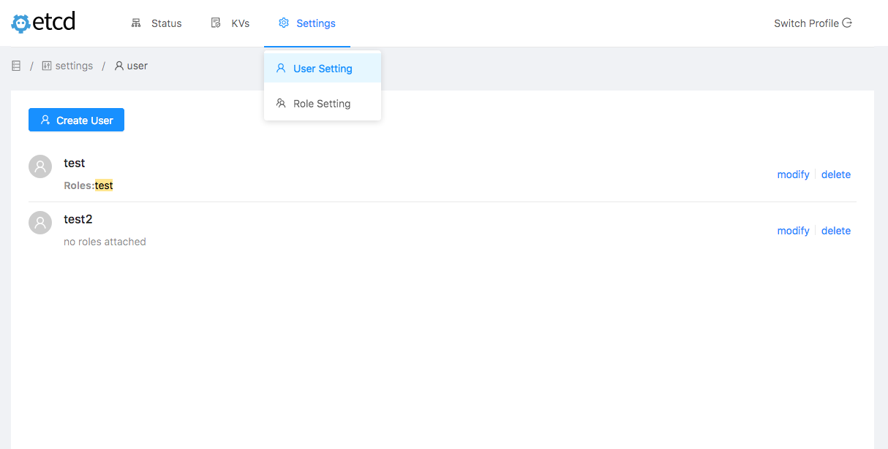
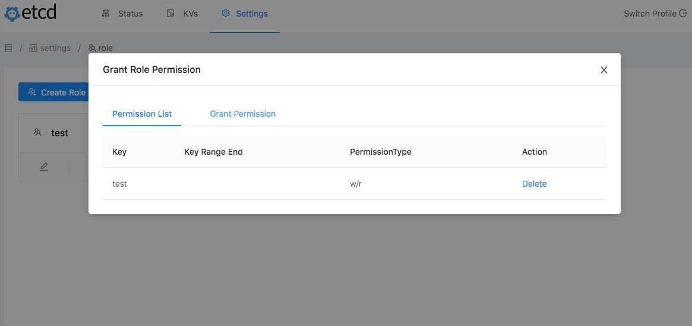
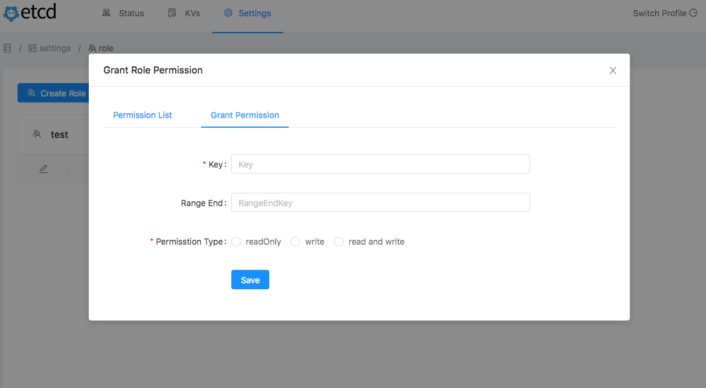

# etcd client webui with v3 api support (base on [etcd/clientv3](https://godoc.org/go.etcd.io/etcd/clientv3))

## setup

download prebuild file from [release page](https://github.com/enshi363/etcd-ctl-ui-bundle/releases)


## Quick Experience

``` shell
docker-compose up -d

```
open browser with http://localhost:8088/webui


## usage

``` shell
# define listen port 
export ETCD_UI_LISTEN_PORT=:8088
# jwt secret key
export ETCD_UI_SECRET=xxxxx

etcd-webui-linux-amd64

```

open browser with http://xx.xx.xx.xx:8088/webui
then enjoy


## screen shots

















## Thanks

[Gin Web Framework](https://github.com/gin-gonic/gin)

[Angularjs](https://angular.io)

[Antd](https://ng.ant.design)
